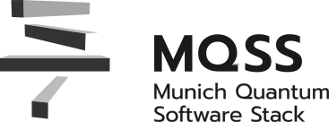

  <picture>
    <source media="(prefers-color-scheme: dark)"
            srcset="docs/assets/mqss_logo_dark.svg">
    
  </picture>

# MQSS Integration Deployment Framework

  

The framework provides an integration layer for communication between software components in a distributed quantum system running in an HPC environment.

Components can interact either through a generic messaging transport or through direct interface calls when deployed within a single process.
This enables flexible deployment and execution across different runtime configurations.

## Design Concepts

The framework separates application logic from the underlying communication mechanism.
It is structured around three main concepts:

- **Transport abstraction**
  Provides a transport-neutral messaging interface that can be implemented using different communication backends.
  It relies on a language-agnostic protocol defining message structure and serialization.

- **Service / domain interfaces**
  Define component functionality independently of the communication mechanism.

- **Transport adapters**
  Bridge service interfaces to the transport layer, allowing services to be exposed or consumed via messaging.

## Version Management

The framework supports component versioning to ensure consistent communication between components and to allow deployment of specific versions when required.

## Deployment Options

The framework allows flexible deployment without changes to application logic:

- **Distributed nodes**
  Components run on separate nodes and communicate via a messaging backend.

- **Local composition**
  Multiple components run within a single process and communicate through direct interface calls.

- **Hybrid systems**
  A combination of both approaches, where some components communicate locally while others use a messaging backend.
