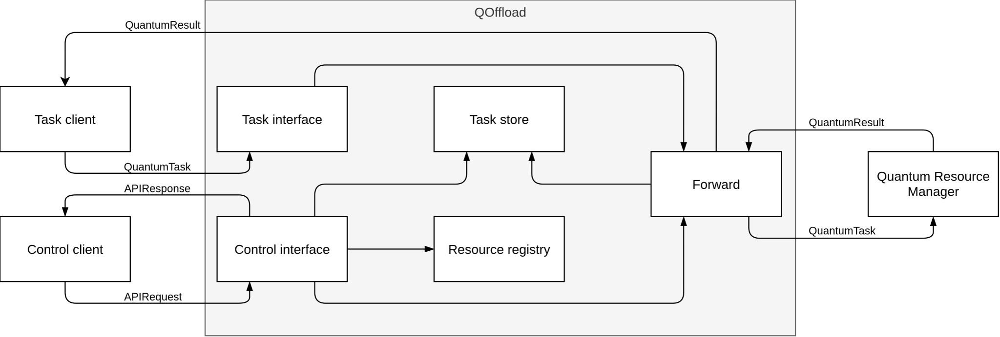

# QOffload

## Overview

QOffload is a distributed service that sits between client applications and the Quantum Resource Manager (QRM).
It accepts quantum workloads from clients, forwards executable `QuantumTask` messages to QRM, receives `QuantumResult` messages, and correlates results with the originating client requests.

QOffload exposes two client-facing interfaces:

- **Task interface** exchanges `QuantumTask` and `QuantumResult` messages directly.
- **Control interface** provides task lifecycle operations and resource queries using the shared `APIRequest` / `APIResponse` protocol.

Although the external protocol uses the message names `APIRequest` and `APIResponse`, this document refers to that communication path as the **Control interface**.

The following diagram shows the QOffload system boundary, its external interfaces, and the main runtime components.

## Message queues

QOffload communicates with clients and QRM through RabbitMQ queues.

| Queue                   | Direction                 | Message type    | Purpose                              |
| ----------------------- | ------------------------- | --------------- | ------------------------------------ |
| Request queue           | Client → QOffload         | `QuantumTask`   | Direct task submission.              |
| Control request queue   | Control client → QOffload | `APIRequest`    | Control request submission.          |
| Result queue            | QRM → QOffload            | `QuantumResult` | Results returned from QRM.           |
| QRM task queue          | QOffload → QRM            | `QuantumTask`   | Tasks forwarded to QRM.              |
| Control response queues | QOffload → Control client | `APIResponse`   | Control responses.                   |
| Direct result queues    | QOffload → Client         | `QuantumResult` | Results for direct task submissions. |

## Runtime structure

### QOffload

The QOffload component owns the application's runtime.
It is responsible for startup, shutdown, worker management, and connecting the messaging layer to the transport-independent application logic.

The runtime processes client requests, forwards tasks to QRM, receives execution results, and handles management requests until shutdown.

Worker responsibilities include:

- receiving direct `QuantumTask` messages and forwarding them to QRM
- receiving control `APIRequest` messages and returning `APIResponse` messages
- receiving `QuantumResult` messages from QRM and either forwarding or storing them

### Forward

The Forward component manages the task and result flow between QOffload and QRM.

For outbound tasks, it:

- assigns a QOffload-local task ID;
- sets the task's result destination to the QOffload result queue;
- applies component policies;
- registers the pending task in `TaskStore`.

When a result is received, it resolves the stored task mapping in one of two ways:

- It restores the original client task ID and destination before forwarding the result.
- It stores the completed result for later retrieval through the Control interface.

### Control

The Control component implements the Control interface.
It translates incoming `APIRequest` messages into commands, executes those commands, and returns the corresponding `APIResponse` messages.

The Control interface provides management operations for tasks and resources.

Task management operations:

- requesting the creation of a `QuantumTask`
- querying task status
- retrieving task results
- retrieving cancel reasons

Resource operations:

- listing available resources
- querying resource information
- querying pending tasks

Protocol handling is isolated from command execution.
Incoming requests are translated into a common command model, and command results are encoded back into the appropriate response format.

#### Control protocol

The Control component supports two protocol variants.
Both translate wire messages into the same command model and encode the resulting responses.
Command execution is protocol-independent.

Supported protocols:

- **Typed protocol**

  Uses dedicated protobuf request and response types for each operation.
  Operations are selected through protobuf `oneof` variants. The legacy REST-like fields in the message envelope are ignored.

- **REST-like protocol**

  Uses the same protobuf transport but encodes REST semantics in generic fields such as method and path.
  This implementation is largely compatible with the Python reference implementation.
  The primary difference is response serialization.  
  The C++ implementation always serializes an `APIResponse` message, whereas the Python implementation returns some responses as top-level JSON objects instead of wrapping them in an `APIResponse`.

### TaskStore

The TaskStore component maintains the mutable task state and provides synchronized access to it.
It tracks:

- pending direct tasks
- pending control-created tasks
- completed control-created task results awaiting retrieval

For direct tasks, TaskStore maintains the mapping between the forwarded QRM task ID and the original client task ID and result queue.

For control-created tasks, the generated task ID is also the externally visible task identifier.

### ResourceRegistry

The ResourceRegistry component maintains the resource catalog exposed through the Control interface.

The current implementation uses a static resource catalog matching the Python reference implementation.
It can later be replaced with dynamic resource discovery without affecting the task processing pipeline.
